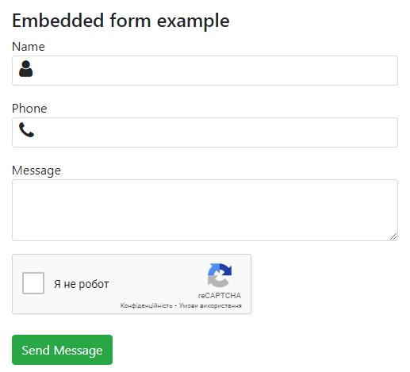
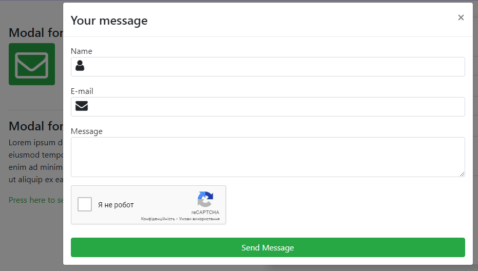
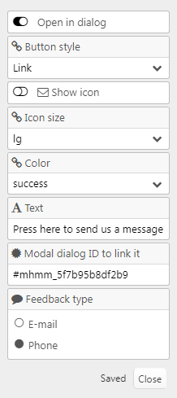

# [mh_Mail](https://github.com/mahotilo/CS.mh_Mail) - Mail form with advanced settings
## Section type for CustomSections plugin (Typesetter CMS)

## About
The plugin adds a section with a mail form. This can be a Bootstrap Modal dialog opened by a link or a button,
or plain mail form. The sender's contact can be an email or phone number with filtered input.

## See also 
* [CustomSections](https://github.com/juek/CustomSections)
* [Typesetter on GitHub](https://github.com/Typesetter/Typesetter)
* [Typesetter Home](http://www.typesettercms.com)

## Current Version 
1.0

## Requirements
* Typesetter CMS
* CustomSections addon installed.
* Bootstrap 3 or 4 theme

## Manual Installation
1. Download the [master ZIP archive](https://github.com/mahotilo/CS.mh_Mail/archive/master.zip)
2. Upload the extracted folder '_types' to your server into the /addons/CustomSections-master/_types directory

## Demo
### Plain mail form

### Dialog

### Settings

## License
GPL 2, for bundled thirdparty components see the respective subdirectories.

## Changelog
* v1.0 
	- First release
